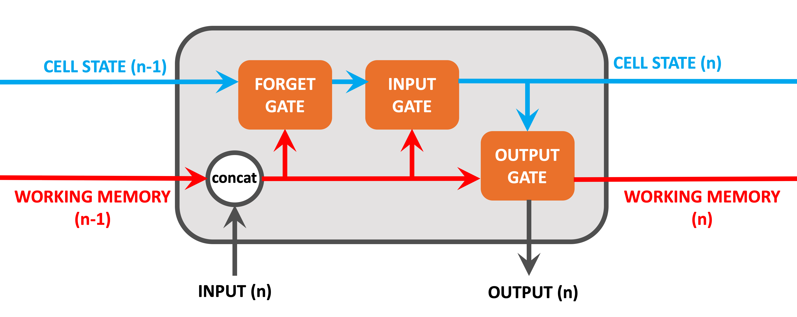
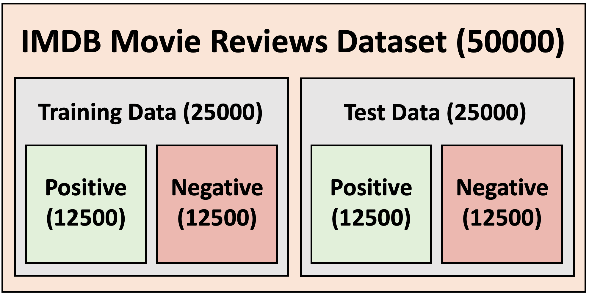
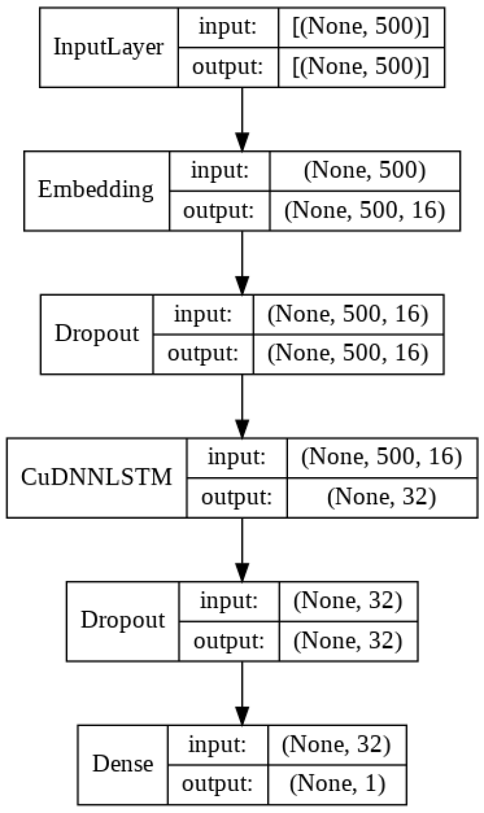

# Sentiment Analysis using LSTM (Long Short Term Memory Networks)

### What is a LSTM?

There are multiple RNN variants that aim to solve the Vanishing Gradient problem where Long Short Term Memory Networks (LSTMs) are currently the most popular. 

As with standard RNNs, LSTMs loop through sequences of data, persisting and aggregating the working memory over mutliple iterations. LSTMs also share weights and activation functions across iterations with weights being optimised via BPTT.

###  IMDB Moview Review Dataset
the Keras IMDB Movie Reviews Dataset. This contains 50000 IMDB Reviews, each one classified as a "positive" or "negative" review. The data is split as follows:

### Tech Stack

- TensorFlow
- Keras

## LSTM Architecture

## Results

|  | precision | recall | f1-score |
|--|--|--|--|
| Negative | 0.85 | 0.90 | 0.88 |
| Positive | 0.89 | 0.85 | 0.87 |
| Accuracy |  |  | 0.87|
| Macro avg | 0.87| 0.87| 0.87|
| Weighted avg | 0.87| 0.87| 0.87|

## References

[LSTM BLog](https://www.bouvet.no/bouvet-deler/explaining-recurrent-neural-networks)
